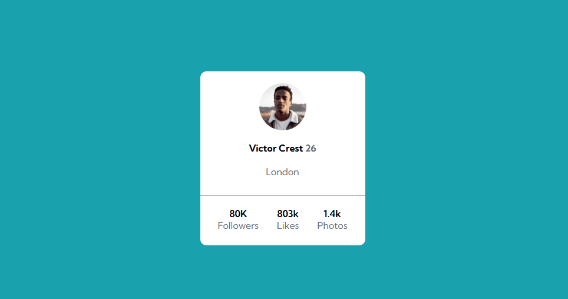

## Esse é o meu primeiro exercício de flexbox que fiz

### Linguagens usadas:
- HTML
- CSS

### Objetivo:
É somente um exercício "responsivo" para poder praticar os conhecimentos de css até a parte de flexbox. É um modelo de componente de perfil de usuário que mostra além do nome e foto, informações a respeito da conta.

---
### Layout
**Desktop/mobile**

    

