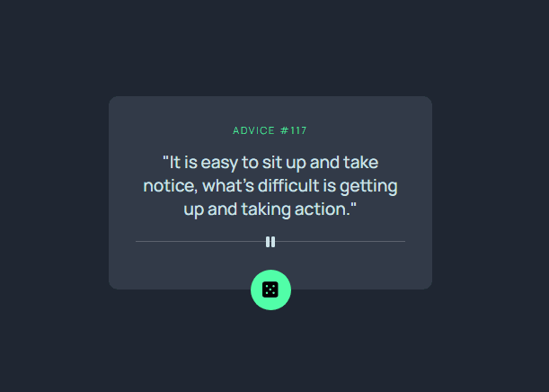

## Advice generator app
É um exercício do Frontend Mentor que fiz voltado somente para a prática de HTML e CSS com flexbox, por isso, não adicionei o JS. Para os posicionamentos de alguns elementos usei o "transform:translate" e "position".
### layout responsivo PC/Mobile
Pc e mobile.

