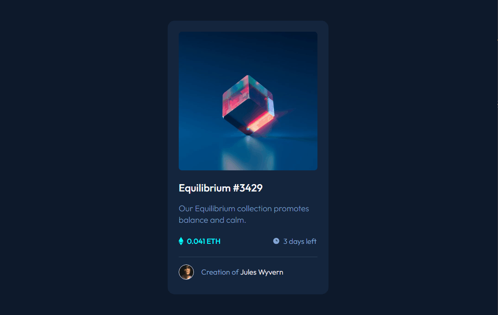

# Template pronto
Projeto feito por mim apartir do layout encontrado no frontendmentor, o destaque vai para o efeito do hover sobre a imagem que foi alcançado em duas camadas de sobreposição usando os pseudo-elementos "before" e "after".

```bash
 Se executar o código é esse layout que vai obter no seu navegador:
```
<p align="center">

</p>